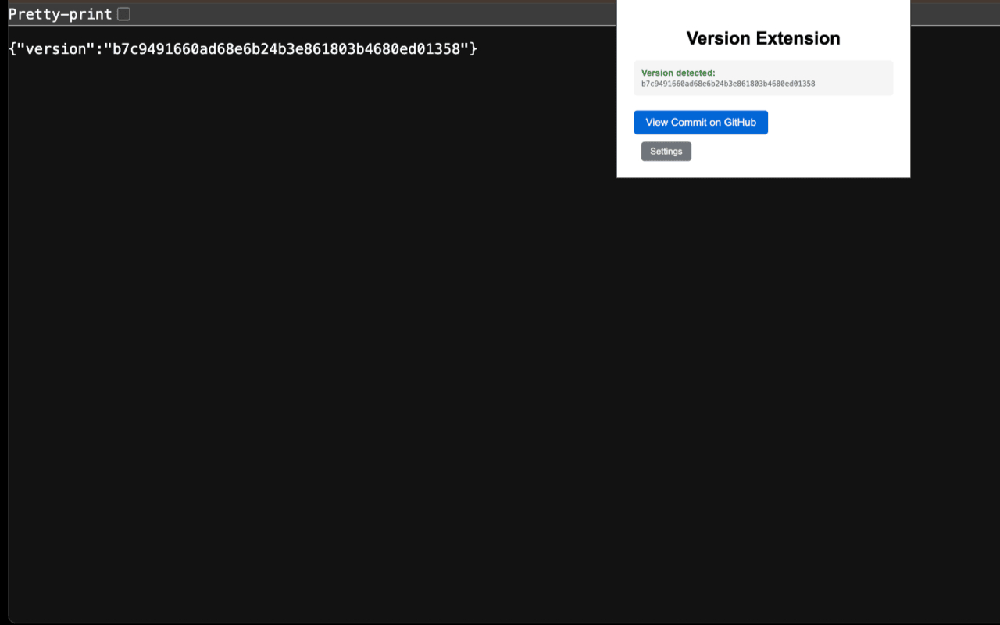

# JSON Version to GitHub Chrome Extension

[Link](https://chromewebstore.google.com/detail/jdaeepijmnhdooonimlnbfeghgefiphn?utm_source=item-share-cb)



A Chrome extension that detects version information in JSON pages and creates direct links to GitHub commits. Perfect for API version tracking and development workflow automation.

## Features

- Automatically detects JSON pages with `version` fields
- Creates direct GitHub commit links based on version values (assumed to be git commit SHAs)
- Configurable URL-to-repository mappings through a settings interface
- Clean, minimal popup interface for quick access

## How It Works

1. The extension scans web pages for JSON content
2. When a `version` field is detected, it extracts the value

```json
{
  "version": "<sha here>",
  ...
}
```

3. Based on your configured URL patterns, it matches the current page to a GitHub repository
4. Creates a direct link to the specific commit: `[repo]/commit/[version]`

## Installation

1. Clone or download this repository
2. Open Chrome and go to `chrome://extensions/`
3. Enable "Developer mode"
4. Click "Load unpacked" and select the extension directory

## Configuration

1. Click the extension icon in your browser toolbar
2. Click "Settings" to configure URL mappings
3. Add URL patterns and their corresponding GitHub repositories

### Example Configuration

- **URL Pattern**: `api.pallet.com`
- **GitHub Repository**: `https://github.com/username/pallet-api`

This will match any URL containing "api.pallet.com" and create GitHub links to the pallet-api repository.

## File Structure

- `manifest.json` - Extension configuration and permissions
- `content.js` - Page scanning and version detection logic
- `popup.html/js` - Extension popup interface
- `options.html/js` - Settings and configuration interface

## Use Cases

- Track API versions during development
- Quick access to specific commit information
- Development workflow automation for teams using version-tagged deployments