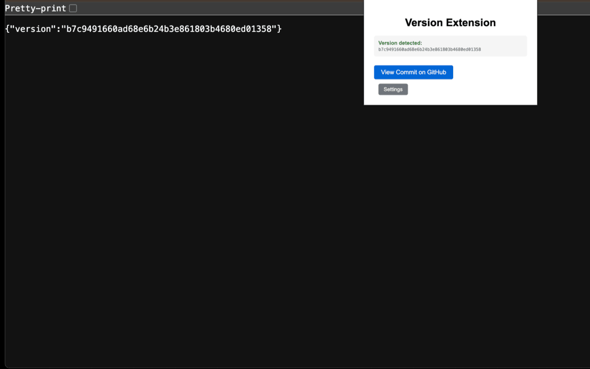

# App/API Version to GitHub Chrome Extension

[](https://chromewebstore.google.com/detail/jdaeepijmnhdooonimlnbfeghgefiphn?utm_source=item-share-cb)



Detects the git SHA of what's deployed on a page and gives you a one-click link to that commit on GitHub.

## Installation

Install from the [Chrome Web Store](https://chromewebstore.google.com/detail/jdaeepijmnhdooonimlnbfeghgefiphn?utm_source=item-share-cb), or load unpacked from source:

```
bun install && bun run build
```

Then go to `chrome://extensions/` → Enable Developer mode → Load unpacked → select the `.output/chrome-mv3/` directory. Built with [WXT](https://wxt.dev/); use `bun run dev` for development with auto-reload.

## Configuration

Click the extension icon → **Settings** → **Add Repository** with a GitHub repo URL (e.g. `https://github.com/org/repo`).

Then add a **matcher** to tell the extension where to find the SHA on a given page:

**JSON page** (e.g. an API `/version` endpoint):
- URL Pattern: `api.example.com/version`
- Source Type: JSON
- JSONPath: `$.version` or `$.build.sha`

```json
{ "version": "a1b2c3d..." }
```

**HTML page** (SHA embedded in a meta tag):
- URL Pattern: `app.example.com`
- Source Type: HTML
- Meta Tag Name: `git-sha`

```html
<meta name="git-sha" content="a1b2c3d...">
```

URL patterns match by substring. You can export/import your full config from the Settings page.
